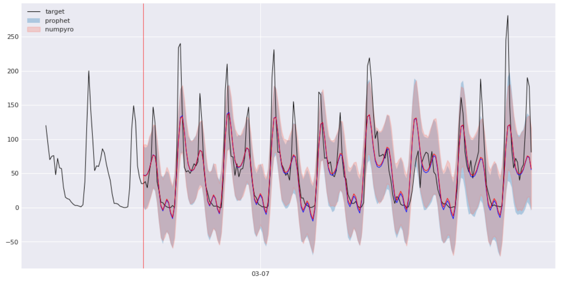

## Notes on Prophet

### Why?

This is not supposed to be a tutorial or a guide, but patchy notes to remind myself how prophet works/ where to tweak it. 

### Overview

In the first part I skim through the prophet code base, highlighting key computation steps. Second part is a small demo of how to extract preprocessed variables from prophet, fit it using another backend (numpyro) and then plug estimated parameters back into prophet for prediction. The purpose is to demonstrate the modeling logic, not to reproduce prophet perfectly.

### Acknowledgements

My main inspiration has been this excellent post [1] from Ritchie Vink (creator of polars). I heavily borrowed from Nicolas Fauchereau's notebook [2] on alaysis of weather impact on cycling counts in Auckland, and used the same data. Finally, I thank developers of prophet [3]. Docs are helpful and the code is easy to navigate. 

1. [Build Facebook's Prophet in PyMC3; Bayesian time series analyis with Generalized Additive Models](https://www.ritchievink.com/blog/2018/10/09/build-facebooks-prophet-in-pymc3-bayesian-time-series-analyis-with-generalized-additive-models/)
2. [The impact of weather conditions on cycling counts in Auckland, New Zealand](https://github.com/nicolasfauchereau/Auckland_Cycling/blob/master/notebooks/Auckland_cycling_and_weather.ipynb)
3. https://github.com/facebook/prophet/tree/main

---

### Contents

**Part I**  
1. [Preprocessing & Feature Construction](#1-preprocessing--feature-construction)  
    * [1.1 Scaling](#11-scaling)  
    * [1.2 Seasonality](#12-seasonality)  
    * [1.3 Holidays](#13-holidays)  
    * [1.4 Regressor Matrix](#14-regressor-matrix)  
    * [1.5 Changepoints](#15-changepoints)  
2. [Fitting](#2-fitting)  
    * [2.1 Model Variables](#21-model-variables)  
3. [Prediction](#3-prediction)  
    * [3.1 Preprocessing](#31-preprocessing)  
    * [3.2 Prediction Components](#32-prediction-components)  
    * [3.3 Trend](#33-trend)  
    * [3.4 Seasonalities](#34-seasonalities)  
    * [3.5 Putting All Together](#35-putting-all-together)  
4. [Uncertainty](#4-uncertainty)  
    * [4.1 Overview](#41-overview)  
    * [4.2 Trend Uncertainty](#42-trend-uncertainty)  
    * [4.3 Seasonality Uncertainty](#43-seasonality-uncertainty)  
  
**Part II**
1. [Setup](#1-setup)
2. [Data Wrangling](#2-data-wrangling)
3. [Fitting](#3-fitting)
4. [Forecasting](#4-forecasting)
5. [Variable Extraction](#5-variable-extraction)
6. [Numpyro Model Specification](#6-numpyro-model-specification)
7. [Model Fitting](#7-model-fitting)
8. [Prophet/Numpyro Param Comparison](#8-prophetnumpyro-param-comparison)
9. [Forecasts Comparison](#9-forecasts-comparison)
10. [Discussion](#discussion)
  
